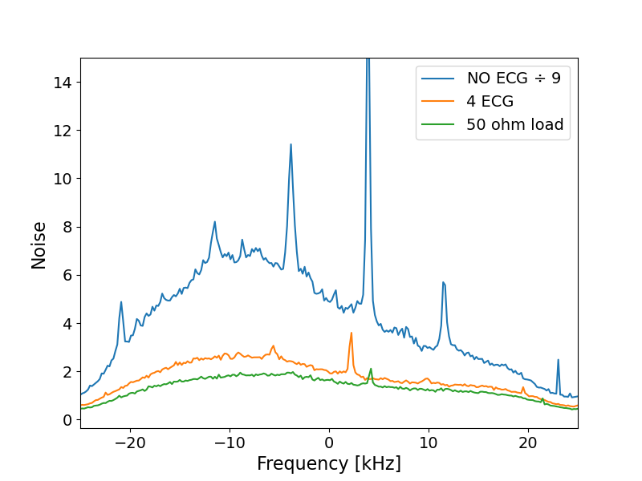
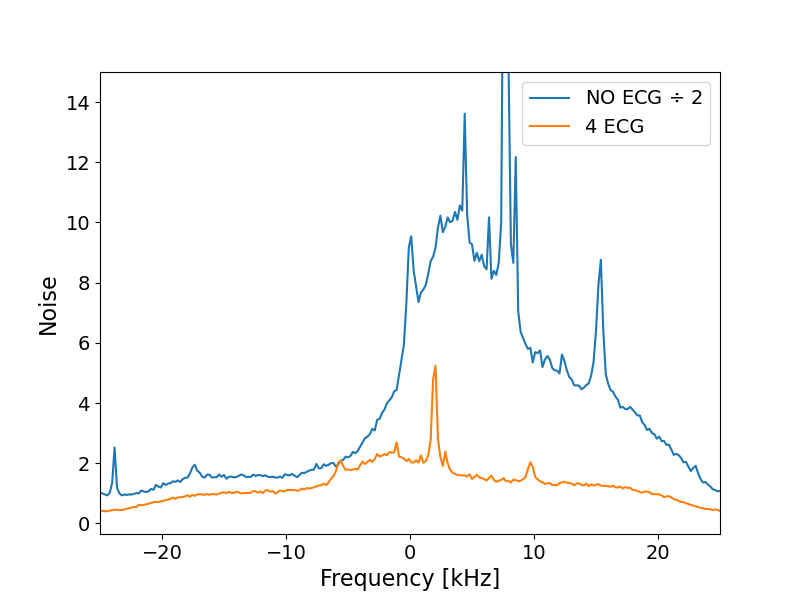

# Data Analysis

## Methods
Images were obtained using a 46 mT Halbach based MRI system using a Magritek Kea2 spectrometer. A solenoidal transmit/receive head-coil and a saddle transmit/solenoid receive coil were used for imaging. The hypothesis of the study was that body acts as an antenna for random noise and EMI arising from specific sources,  and that grounding the body to a common ground with the other electronics would decrease the noise coupled into the receiver coil. To confirm this hypothesis, in-vivo data was acquired in which the volunteer was grounded by placing two ECG electrodes (3M Red Dot ECG electrodes) on the imaged arm and one for each leg. \
To verify the efficacy of grounding, noise scans were acquired in ambient noise propagation via the human antenna effect, for different volunteers. A 50 ohm load was used as reference for the thermal noise floor.\
A polynomial function was fitted to the noise profile to estimate the noise level. 

## Data
All in-vivo data acquired can be found in the `data` folder.  The locations of the ECG are highlighted in the `photos` folder, together with few close-ups of the grounding.

## Results
The maximum fitted noise in different conditions in the volunteers is in the `Noise_measurement` table.

As example, in one volunteer, using the solenoid coil, the noise profile is:

It is immediately evident that with 4 ECG, we are close to the thermal noise floor.

Effective noise reduction has been observed also using the saddle/solenoid coil:

