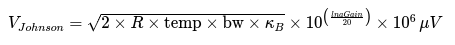
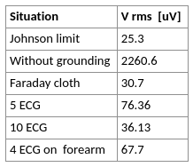

# Data Analysis

## Methods
72 mT Halbach system with MaRCoS as the control system is used. Wrist acquisitions are obtained with a single solenoidal radio frequency coil used for both transmission and reception. Different ECG positions on the volunteer are studied. In each situation, noise scans are acquired from which the rms value of each acquisition is calculated in order to compare it with the expected Johnson limit (see equation below). In addition, we compare the results with the noise present when the volunteer is covered by a faraday cloth and without any grounding.



## Data
All in-vivo data acquired can be found in the `data` folder.
To obtain rms value of each rawData: 
```python analysis.py```

## Results
The table below shows the rms values obtained in each of the acquisitions performed. It is needed to place a larger number of ECGs to reach levels close to the Johnson limit than in Leiden experiment. It is observed that electrodes placed closer to the scanned body part have a greater influence on the noise. 


